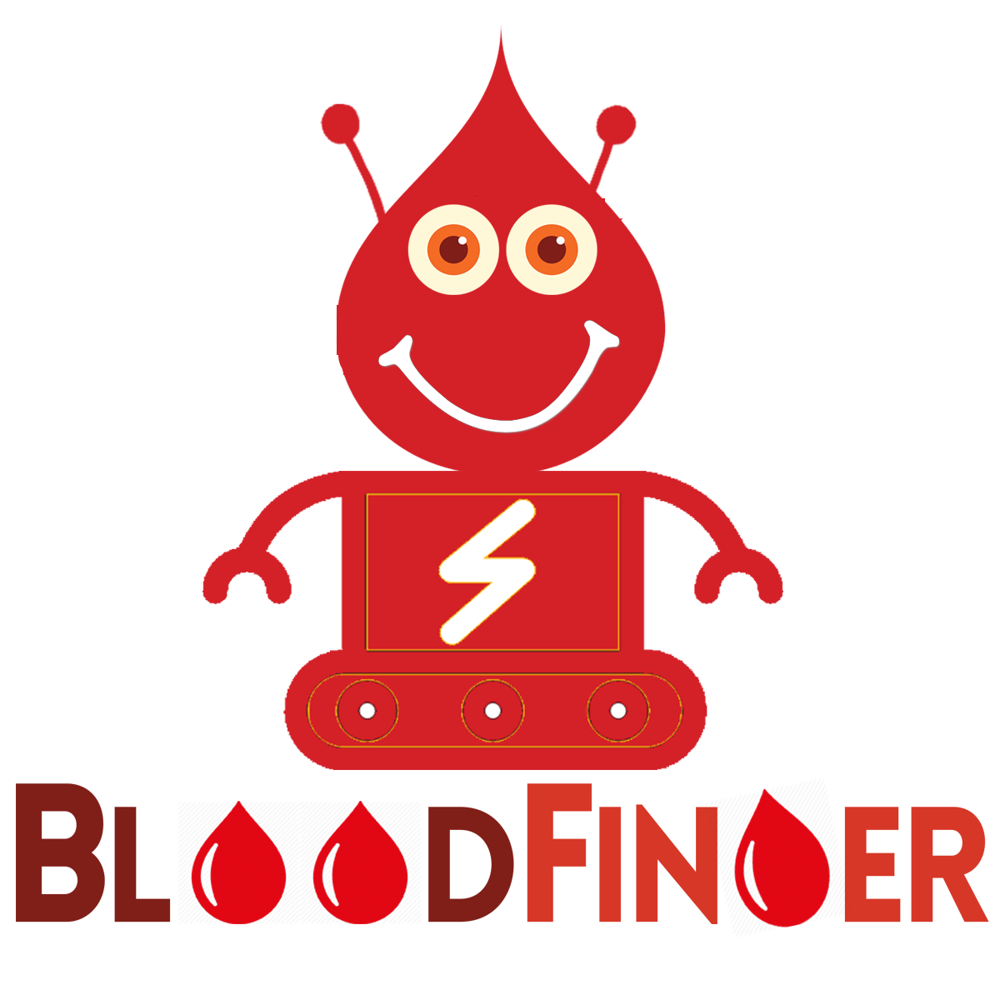

# Codechella Final Project
<!-- PROJECT LOGO -->
<br />
<p align="center">
  <a href="https://github.com/codechella2020/codechella_final_project">
    
  </a>

  <p align="center">
    <a href="https://codechella2020.000webhostapp.com">View Website</a> ||
    <a href="https://twitter.com/BloodFinderBot">View Bot</a> ||
    <a href="https://youtu.be/8YWwU9GH9mQ">Video Demo</a> ||
    <a href="https://docs.google.com/presentation/d/1XAw04aVSlmz4RWXaFN22hliDMLPUODpYvaOpkUG1vgk/edit?usp=sharing">View Documentation</a>
  </p>
</p>

## About The Project

Today the Corona Pandemic has affected all in a way or so and the entire mankind has been forced into introspection, reflection, and analysis of what Nature wishes to communicate.
During Corona Pandemic, everything is happening virtually but yet there are certain people who are forced to do from door to door of a blood bank in search of the blood for their patient and sometimes the person is unable to get the required blood group in time and lose their dear ones.

Here we present before you our #HackForGood solution for the society serving the need for the present time.

The aim is to provide emergency blood bank service to the person who mentions “@BloodFinderBot” on their twitter handle requesting the blood group and specifying their city.


## Built With

Tech Stack – 
* [HTML5]
* [CSS3]
* [bootstrap4]
* [PHP7]
* [MySQL]
* [Jquery]
* [Ajax]
* [Python]
* [Twitter API’s]
* [Google Colab]

Deployment –
* [000webhost]
* [Heroku]


## Installation

1. Get a Twitter Developer API Key at [Twitter Developer](https://developer.twitter.com/en)
2. Clone the repo
```sh
git clone https://github.com/codechella2020/codechella_final_project.git
```
3. Install NPM packages
```sh
npm install
```

## Developed By -

* [Akash Modak](https://github.com/akashmodak97)
* [Bharati Sharma](https://github.com/bhartiddn01)
* [Swarup Dey Sarkar](https://github.com/deysarkarswarup)


## Contributing

Contributions are what make the open source community such an amazing place to be learn, inspire, and create. Any contributions you make are **greatly appreciated**.
1. Fork the Project
2. Create your Feature Branch (`git checkout -b feature/AmazingFeature`)
3. Commit your Changes (`git commit -m 'Add some AmazingFeature'`)
4. Push to the Branch (`git push origin feature/AmazingFeature`)
5. Open a Pull Request

## License

Distributed under the MIT License. See `LICENSE` for more information.

## Contact

Blood Finder Bot - [@BloodFinderBot](https://twitter.com/BloodFinderBot)
Project Link: [https://github.com/codechella2020/codechella_final_project/](https://github.com/codechella2020/codechella_final_project/)
